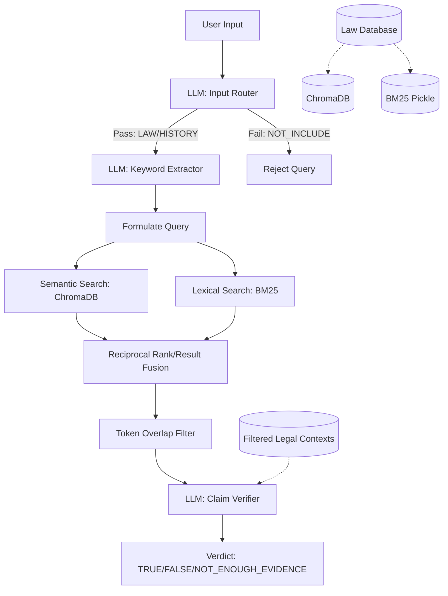

# 📘 System Documentation

## 1. Overview

The **Vietnamese Fake News Detection System** is an AI-driven, evidence-based claim verification platform designed to authenticate user statements against a curated set of legal and historical documents. 

Its main purpose is to mitigate misinformation and hallucinations by grounding language model responses strictly within domain-specific knowledge (primarily Law). It targets researchers, legal personnel, and the general public seeking to verify the validity of Vietnamese statements and news.

## 2. Architecture

* **High-Level Architecture**: The system utilizes a **Hybrid Retrieval-Augmented Generation (RAG)** architecture. It employs a local LLM orchestrator combined with a dual-retriever mechanism mapping across Lexical (BM25) and Semantic (ChromaDB) search vectorizations.
* **Type**: Hybrid Monolith (Script-based pipelines locally driven, suitable for future Microservices refactoring if API routing is added).
* **Architecture Diagram**:


## 3. Core Components

### A. Input Processing & Claim Verification (`check_input.py`)
* **Responsibility**: Orchestrates the analysis. Validates input context, synthesizes hybrid search documents, calculates confidence, and directs the final LLM to generate verifiable verdicts.
* **Tech Stack**: Python, Ollama (`llama3.2`), `underthesea` (Vietnamese NLP tokenizer).
* **Interaction**: Acts as the central controller interacting with both `search_chormadb.py` and `search_bm25.py`.

### B. Semantic Retriever (`search_chormadb.py` & `embedder.py`)
* **Responsibility**: Manages the Vector Database and performs dense semantic search to discover contextually relevant law clauses without exact word usage matches.
* **Tech Stack**: `ChromaDB`, `SentenceTransformers`, `PyTorch`.
* **Interaction**: Called by the main verification script. Utilizes the shared `BGEM3Embedder` class.

### C. Lexical Retriever (`search_bm25.py`)
* **Responsibility**: Performs traditional keyword matching, focusing on exact terminology overlaps which are crucial for exact legal identifiers (e.g., "Điều 25").
* **Tech Stack**: `numpy`, Python `pickle`, custom BM25 statistical algorithm.
* **Interaction**: Processes tokenized Vietnamese strings and returns scored indices mapped to documents in the metadata registry.

### D. Knowledge Builders (`create_law_db.py`, `create_bm25.py`)
* **Responsibility**: The offline batch processing pipeline handling chunked JSON (`law_chunks.json`), transforming, embedding, and loading it into long-term datastores.
* **Tech Stack**: `json`, `chromadb`, `SentenceTransformers`, Local FS. 

## 4. Data Flow

1. **Input Submission**: User provides a claim string (e.g., *"Việt Nam là một quốc gia độc lập..."*).
2. **Pre-Processing (Routing)**: System calls `llama3.2` to ensure the topic concerns LAW or HISTORY. Irrelevant prompts are immediately rejected.
3. **Keyword Extraction**: `llama3.2` extracts core entities and technical terms.
4. **Hybrid Retrieval**: The user's expanded query searches two stores independently. Returns top `K` candidates each.
5. **Deduplication & Fusion**: Overlapping documents from both retrievers are merged.
6. **Filtering (`filter_relevant_docs`)**: The context blocks are aggressively pruned via token-overlap checks (requiring at least 3 keyword overlapping hits).
7. **Verification Generation**: The pruned context blocks, alongside strict rule-based prompt instructions, are passed to the `llama3.2` verifier (Temperature = 0) targeting Boolean extraction.
8. **Output**: System yields a parsed dictionary containing Verdict, Confidence Score, Evidence, and Reason.

## 5. AI / NLP / RAG Pipeline

* **Embedding Model**: `BAAI/bge-m3` via `SentenceTransformer` (1024 dense dimensions). Optimized for multi-lingual and strong semantic representations.
* **Vector Database**: `ChromaDB` (Persistent local storage, utilizing `cosine` distance).
* **Retrieval Strategy**: **Hybrid Search**, balancing Semantic representation (Chroma) and Lexical Exact-Match (BM25). Includes a post-retrieval filtering step checking exact word intersections mapped via `underthesea` syntax.
* **Prompting / LLM Usage**: Uses Local **LLaMA 3.2** via Ollama API. Prompts enforce structured JSON-like line returns and explicitly ban external hallucinations ("NGHIÊM CẤM").

## 6. Database & Storage

* **Type**: Vector Database (ChromaDB) + Serialized Object Store (Pickle).
* **Schema**:
    * Documents list: String payload.
    * Metadata dictionary: `{"title": str, "article": str, "url": str, "chunk_id": int}`
    * Overlapping IDs: `law_chunk_{i}`
* **Data Lifecycle**: Manually ingested batch data (`law_chunks.json`) parsed via `create_law_db.py` in chunks of `8`, converting them into persistent local SQLite DB mapping / HNSW index. 

## 7. API Design

Currently operates as an internal Python module, but exposes structured deterministic dictionaries suitable for REST API wrapper:

* **Main Entry Point**: `verify_claim(query, docs)`
* **Response Structure**:
```json
{
  "verdict": "TRUE | FALSE | NOT_ENOUGH_EVIDENCE",
  "confidence": "85.50%",
  "evidence": "Điều 1 Hiến pháp năm 2013",
  "reason": "Điều 1 quy định rõ Việt Nam là quốc gia độc lập."
}
```

## 8. Deployment & Infrastructure

* **Hosting**: The system is designed for a Local or dedicated VPS environment with GPU/High CPU thread availability due to local LLM requirements (`torch.set_num_threads(4)` explicit).
* **Dependency**: Requires `Ollama` process running locally to serve `llama3.2`.
* **CI/CD & Scaling**: Currently missing. To scale, external LLM endpoints (like GPT-4o or DeepSeek APIs via LiteLLM) or a dedicated GPU inference cluster serving LLaMA 3.2 would be required.

## 9. Strengths

* **Zero-Hallucination Design Focus**: The system is inherently conservative. If context lacks evidence, the strict verifier prompt defaults to `NOT_ENOUGH_EVIDENCE`.
* **Multilayered Retrieval Assessment**: Calculating confidence dynamically using standard lexical ranking, vector similarity, and tokenized evidence overlaps yields transparent grading.
* **Vietnamese NLP Customization**: Out-of-the-box token splitting specifically adjusted for Vietnamese text constructs using `underthesea`.

## 10. Weaknesses & Risks

* **Latency Bottleneck**: Requires **three concurrent LLM inferences** for a single request (Routing -> Extraction -> Verification), slowing real-time deployments significantly.
* **Environmental Brittleness**: Several scripts contain hardcoded absolute pathings (e.g., `D:\Fake-news-detections\` and `/content/drive/MyDrive/`) creating instant deployment failure on a new host.
* **BM25 Drift**: Lexical Pickle index requires manual rebuilding whenever ChromaDB vector store is updated (No automated sync or change-data capture).

## 11. Suggested Improvements

* **Refactor Hardcoded Paths**: Replace all `D:\..` and `/content/..` strings with relative mapping utilizing the established `src/config.py` structure (`PROJECT_ROOT / "RAG_LAW/Models/..."`).
* **LLM Consolidation (Latency Fix)**: Consolidate the Routing and Keyword Extraction phases into a single Prompt call that returns a JSON schema (e.g., `{"category": "LAW", "keywords": ["..."]}`). This drops the LLM overhead by 33%.
* **Web Server Abstraction**: Wrap the pipeline in `FastAPI`.
* **Asynchronous Calls**: Transition processing tasks, primarily LLM requests and dual-retrieval pipeline execution, to `asyncio` to unblock threads.
